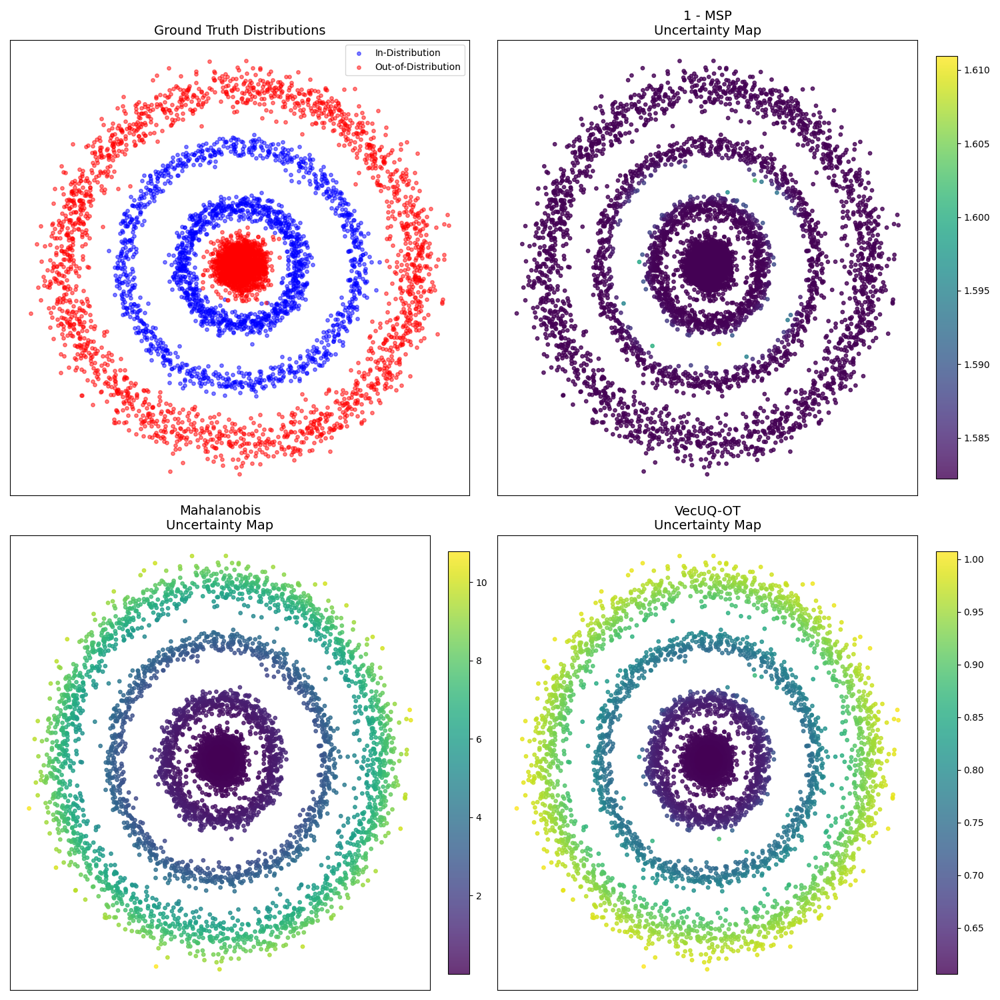
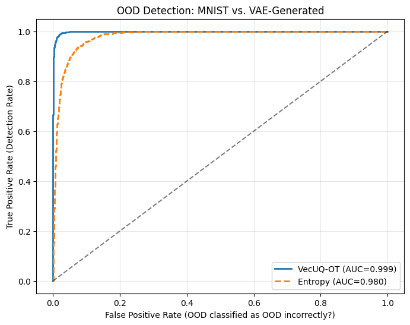

# Bayesian Methods: Multidimensional Uncertainty Quantification via Optimal Transport

This repository presents a review and experimental analysis of the paper **"Multidimensional Uncertainty Quantification via Optimal Transport"** by Kotelevskii et al. (2025).

📄 **Paper:** [arXiv:2509.22380](https://arxiv.org/pdf/2509.22380)

## Project Overview

In this project, we explore the **VecUQ-OT** framework proposed by the authors, which introduces a method to aggregate disparate uncertainty measures (such as entropy and Mahalanobis distance) into a single scalar rank using **Optimal Transport**.

Our goal was to **verify the method's robustness and analyze its behavior** through a series of targeted experiments. We aim to strengthen the understanding of the method's capabilities and verify specific limitations mentioned in the original work.

### 1. Synthetic Analysis: Verifying Convex Hull Limitations
We verified a key limitation mentioned in **Section 3.1** of the paper: the barycentric projection used in VecUQ-OT is theoretically constrained to the convex hull of the target support (the training uncertainty scores). This suggests the method might struggle if test uncertainty vectors fall significantly outside the range seen during training.

* **Setup:** We created a synthetic dataset shown in the image below, where **Blue points are In-Distribution (ID)** concentric rings and **Red points are Out-of-Distribution (OOD)**. Specifically, we placed OOD points in the center and far outside the rings.
* **Observation:** We observe that incorporating the 'Outer Anchors' mechanism (as proposed in the paper) successfully rectifies the detection of distant outliers, allowing the method to correctly identify the outer ring as OOD. However, we also confirm a fundamental limitation: VecUQ-OT cannot generate uncertainty signals out of thin air. If the underlying base metrics (e.g., Mahalanobis or MSP)  cannot capture a specific type of OOD behavior (such as the inner blob), proposed method will also fail to capture it.


### 2. Misclassification Detection: Rejection Curves
We evaluated the utility of the uncertainty scores on the FashionMNIST dataset, focusing on the impact of removing uncertain samples.

* **Objective:** To demonstrate that samples flagged with high uncertainty are indeed the "hardest" for the model to classify, and that removing them significantly improves model performance.
* **Robustness:** We also highlight that VecUQ-OT is robust to "weak" signals. Even if we include a sub-optimal uncertainty metric (like Mahalanobis distance, which performs poorly on this specific high-dimensional task) in the vector stack, the final aggregated score remains effective. This suggests we can safely stack multiple diverse uncertainty methods without degrading performance.
* **Observation:** The plot below shows that removing the most uncertain samples leads to an increase in accuracy. In contrast, we checked that dropping random samples do not provide improvement in metrics, confirming that the uncertainty rank effectively identifies error-prone samples.


### 3. Out-of-Distribution Robustness: MNIST vs. VAE
We extended the evaluation to a Generative OOD setting.
* **Objective:** To test the network's ability to distinguish between real MNIST digits and "fake" digits generated by a Variational Autoencoder (VAE).
* **Observation:** The method effectively assigns higher uncertainty ranks to VAE-generated samples, demonstrating robustness against semantically similar but distributionally distinct inputs comparing to entropy method.



---

## Installation Guide

### 1. Clone this Repository
```bash
git clone git@github.com:chousouu/bayesian-methods.git
cd bayesian-methods
git clone git@github.com:stat-ml/multidimensional_uncertainty.git

# Enter the directory
cd multidimensional_uncertainty
```

⚠️ We were unable to use the project without changing versions in pyproject.toml. We replace its entire content with the following configuration. This helped us to build without version compatibility issues:
```bash
[build-system]
requires = ["setuptools>=61.0"]
build-backend = "setuptools.build_meta"

[project]
name = "multidimensional-uncertainty"
version = "0.1.0"
description = "Multidimensional Uncertainty Quantification via Optimal Transport"
readme = "README.md"
requires-python = ">=3.10"
dependencies = [
    "ipykernel>=6.30.0",
    "jupyterlab>=4.4.5",
    "matplotlib>=3.10.3",
    "numpy>=2.2.0",
    "pot>=0.9.5",
    "scikit-learn>=1.7.0",
    "seaborn>=0.13.2",
    "torch>=2.2.2",
    "tqdm>=4.67.1",
]

[tool.setuptools]
# Explicitly define packages to avoid "Multiple top-level packages" errors
packages = ["mdu", "configs"]
```

### 2. Now do the following:
```bash
pip install -e .

# Return to the main project folder
cd ..
```

### 3. Install Project Requirements

Install the remaining dependencies for our experiments:
```bash
pip install -r requirements.txt
```
## Usage
You can reproduce our experiments by running the provided scripts:

```bash
# 1. Run Synthetic Analysis (Generates results/hole.png)
python synthetic_holes.py

# 2. Generate Rejection Curves (Generates results/rejection_curve.png)
python rejection_curve.py

# 3. Run OOD Detection (MNIST vs VAE)
python ood_detection.py
```